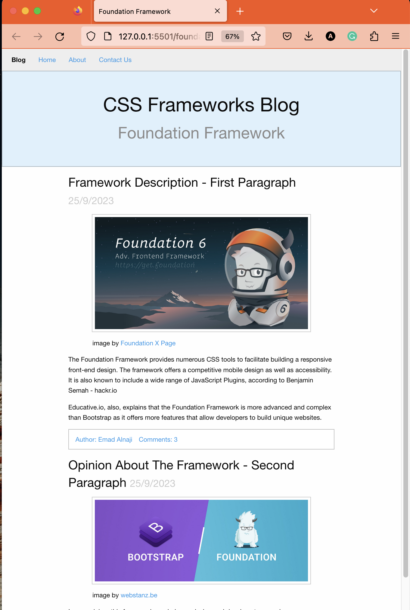

# CSS Framework Research Assignment - week3

## Foundation Framework
The Foundation Framework provides numerous CSS tools to facilitate building a responsive front-end design. The framework offers a competitive mobile design as well as accessibility. It is also known to include a wide range of JavaScript Plugins, according to Benjamin Semah - hackr.io
Educative.io explains that the Foundation Framework is more advanced and complex than Bootstrap as it offers more features that allow developers to build unique websites.

In my opinion, this framework can help me design and develop strong web pages, especially since it is lightweight compared to other frameworks, yet it provides more clear semantics with more customizing options. While advancing in this career, this framework can help me stand out with my unique work and while developing more experience, I believe the work could be done faster with better quality and design. 

An Example Page: 

### References:
- [Foundation](https://get.foundation)
- [hackr.io](https://hackr.io/blog/best-css-frameworks)  
- [educative.io](https://www.educative.io/answers/what-is-the-difference-between-bootstrap-and-foundation)  